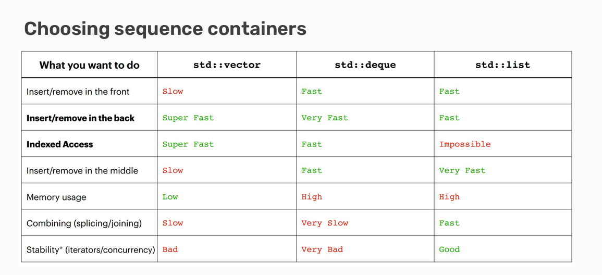

# 5. Containers

## Defining Containers

Container: An object that allows us to
&#x20;collect other objects together and interact
&#x20;with them in some way.

Think of **vectors(向量)**, **stacks(堆)**, or **queues(队列)**!

### Why Containers?

1. Organization: Related data
   &#x20;can be
   &#x20;packaged
   &#x20;together!
2. Standardization: Common
   &#x20;features are
   &#x20;expected and
   &#x20;implemented
3. Abstraction: Complex ideas
   &#x20;made easier to
   &#x20;utilize by
   &#x20;clients

## Containers in the STL

容器有一些标准的, 基础的功能:

* 存储多种对象
* 允许对容器集合通过一些方法访问
  * 可能允许对对象遍历
* 可能允许编辑/删除

### STL中有许多容器

* Vector(向量)
* Stack(栈)
* Queue(队列)
* Set(集合)
* Map(键值对)
* Array(数组)
* Deque(双端队列)
* List(列表)
* Unordered set(无序集)
* Unordered map(无序键值对)

* 数组是向量的初级形式
  * 固定顺序, 固定长度
* 列表是一个双链表
  * 可以从两个方向遍历

### Safety vs Speed

在选择编程语言时, 总要在**速度**, **性能**, **安全**之间做取舍.

### C++的设计哲学

* 只在必要时进行检查
* 程序员掌控一切

对你自己做的事负责.

### Two types of containers

Sequence:

* 可以顺序访问的容器
* 自带顺序

Associative:

* 不需要有序的容器
* 更容易搜索
* 例如map和set

### Vector implementation

* 在高层次上, 向量是一个有序集合, 存储相同类型的元素, 大小可以增大或减小.
* 事实上, 向量实现了数组.

关注一些成员变量:

* \_size = 向量的元素个数
* \_capacity = 为元素分配的空间

### Choosing containers

<figure><figcaption></figcaption></figure>

* 需要强调有序性时, 使用有序容器
* 绝大多数情况都可以使用std::vector
* 需要在队首快速插入时, 使用std::deque

### Map implementation

map是用pair实现的(std::pair\<const key, value>)

* 键是不可变的
* 对map的下标访问, 搜索所有的pair, 匹配第一项时, 返回第二项

### Unordered maps/sets

maps和sets都有无序版本

* 有序map/set需要一个偏序运算符定义
* 无序map/set需要一个hash函数定义

无序版本通常比有序的更快

### Choosing associative containers

* 无序容器更快, 但难以处理嵌套容器/集合
* 使用复杂数据类型时, 或是不熟悉hash函数, 使用有序容器

## Container Adaptors

Container adaptor是对已有容器的一层"封装"

* adaptor规定了对使用者暴露的接口, 规定容器可以被怎样交互

